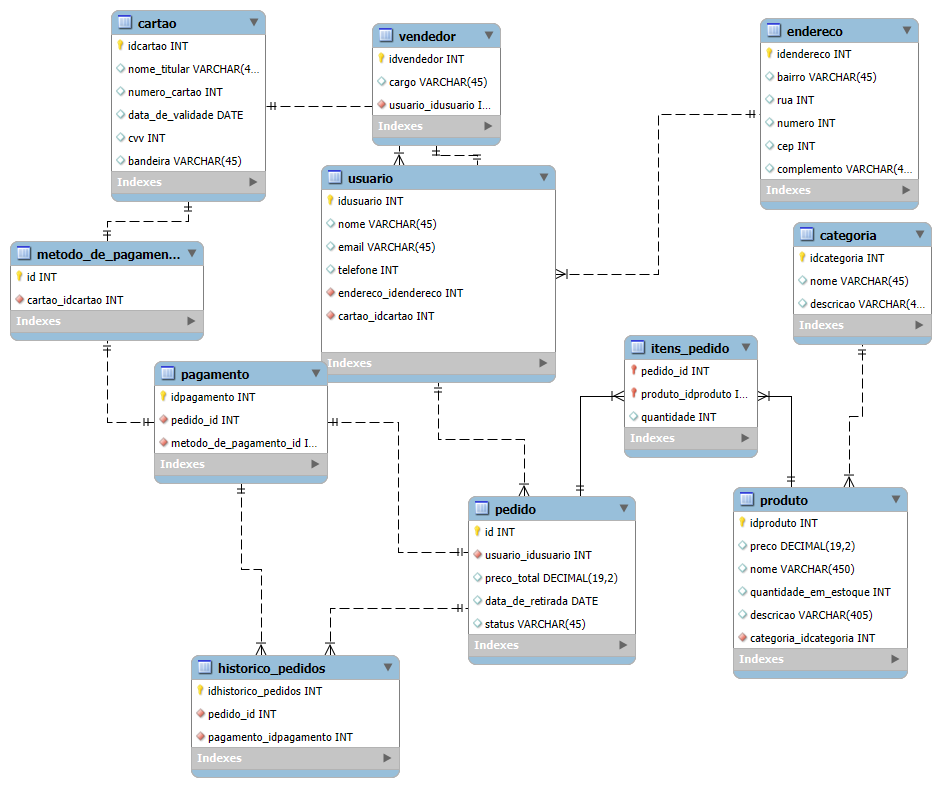

# Projeto Integrador
*La Casa Di Frango*

Desenvolvimento do Projeto Integrador do Curso de Técnico em Desenvolvimento de Sistemas para a Internet Integrado ao Ensino Médio do IFC - Campus Araquari.
*O projeto "La Casa di Frango" visa desenvolver um aplicativo para otimizar o processo de pedidos e a gestão da loja. Com o crescimento da demanda, a loja busca oferecer uma experiência mais ágil e eficiente tanto para os clientes, que poderão fazer pedidos diretamente pelo app, quanto para o vendedor, que terá mais controle sobre as vendas e o estoque. O sistema promete facilitar o gerenciamento diário e melhorar a experiência de compra.*

Professor: [Marco André Mendes](github.com/marcoandre)

Equipe:
- [Davi de Morais Bisewski](https://github.com/DaviBisewski)
- [Enzo Girardi](https://github.com/EnzoGirardi)
- [Henrique Chepli de Souza](https://github.com/HenriqueChepli)

Links do projeto:
-   Backend: [Repositório](https://github.com/HenriqueChepli/BackEnd-LaCasaDiFrango) e [Publicação](https://pi-backend.herokuapp.com/)
-   Frontend: [Repositório](https://github.com/HenriqueChepli/FrontEnd-LaCasaDiFrango) e [Publicação](https://pi-frontend.herokuapp.com/)

# 2. Situação Problema

*A empresa La Casa Di Frango está no ramo alimentício da cidade de Joinville a mais de 30 anos. Gerenciada por Claudinei Bisewski, é uma micro-empresa familiar. 
Atualmente, a loja enfrenta dificuldades no gerenciamento de pedidos e no controle de informações entre os clientes e os vendedores. O processo de encomenda é feito de forma manual, o que leva a erros frequentes e a um tempo maior de espera para os clientes. Os clientes precisam ligar ou ir até a loja para fazer pedidos, o que resulta em uma experiência menos prática e mais demorada. Além disso, o vendedor recebe as informações dos pedidos de forma verbal ou por escrito, o que torna difícil rastrear as encomendas e verificar se todos os dados do cliente estão corretos.
Outro ponto crítico é a falta de controle e visibilidade sobre o desempenho das vendas e a gestão do estoque. Não há um sistema automatizado que forneça relatórios sobre a quantidade de pedidos, vendas realizadas ou itens mais procurados. Isso dificulta a tomada de decisões estratégicas para reposição de estoque ou ajustes nas promoções e cardápio da loja. O vendedor também tem dificuldades em acompanhar as encomendas em tempo real, o que pode gerar confusão no momento de entrega ou retirada dos pedidos.
Além disso, os clientes frequentemente precisam fornecer seus dados pessoais, como nome e telefone, a cada novo pedido, o que torna o processo repetitivo e ineficiente. Isso também impede que a loja construa um banco de dados com informações valiosas sobre os clientes para promoções ou fidelização.*

# 3. Descrição da proposta

O projeto consiste no desenvolvimento de um app que conecta clientes ao vendedor do restaurante "La Casa di Frango", facilitando o processo de encomenda e retirada de produtos. O aplicativo será dividido em duas interfaces principais: uma para o usuário e outra para o vendedor.

Para o usuário: O cliente poderá acessar informações detalhadas sobre o estabelecimento, visualizar o catálogo de produtos disponíveis, e realizar suas encomendas diretamente pelo app. Durante o processo de encomenda, o usuário fornecerá dados como nome, telefone e detalhes do pedido. O sistema garantirá uma experiência simples e rápida, permitindo ao cliente realizar o pedido de forma prática e sem dificuldades.

Para o vendedor: O vendedor receberá as informações do pedido em tempo real, podendo visualizar os dados de cada cliente e o que foi solicitado. Após a retirada do pedido, o vendedor também poderá registrar essas informações no aplicativo, garantindo que o sistema esteja sempre atualizado. Além disso, o vendedor terá acesso a relatórios completos sobre pedidos realizados, vendas e outros dados relevantes, facilitando o gerenciamento e a tomada de decisões. 

# 4. Modelagem de Dados

# 5. Regras de Negócio

- **RN01** - O sistema deve manter os dados do usuário, sendo eles: nome completo, email e telefone.  
- **RN02** - O telefone informado deve ser verificado por meio de um código de confirmação via WhatsApp, como parte do processo de cadastro e validação de usuários.  
- **RN03** - O sistema deve manter os dados de endereço do usuário, incluindo bairro, rua, número, CEP e complemento, alinhado ao controle de informações residenciais.  
- **RN04** - O usuário poderá acessar informações como nome, localização e horário de funcionamento do restaurante, história e galeria, por meio da funcionalidade de exibição de dados institucionais.  
- **RN05** - O histórico de pedidos deve apresentar data, produtos comprados, valor total e status (pendente, pronto, retirado), utilizando as informações da funcionalidade de consulta de pedidos realizados.  
- **RN06** - O sistema deve manter os dados do cartão de crédito, incluindo nome do titular, número do cartão, data de validade e CVV, garantindo a persistência segura das informações de pagamento.  
- **RN07** - Os dados dos produtos devem ser mantidos, sendo eles nome, preço, imagem e descrição, como parte da estrutura de gerenciamento do catálogo.  
- **RN08** - O sistema deve manter as informações do pedido, abrangendo produtos, quantidade, preço total e data de retirada, com base no fluxo de criação e controle de pedidos.  
- **RN09** - Cada pedido deve exibir nome do cliente, itens solicitados, quantidade, valor total e horário do pedido, compondo a visualização detalhada no painel do vendedor.  
- **RN10** - O cadastro de novos pedidos deve conter produtos, quantidade, preço total e data de retirada, integrando o processo de registro manual feito pelo vendedor.  
- **RN11** - O status do pedido deve poder ser alterado para “Confirmado”, “Pronto para retirada” ou “Retirado”, conforme a etapa de atualização de andamento dos pedidos.  
- **RN12** - O sistema deve apresentar, em relatórios de controle de estoque, os produtos feitos, vendidos e restantes, com base nos registros operacionais.  
- **RN13** - Devem ser geradas informações de lucros, gastos e prejuízos a partir dos dados financeiros do sistema, permitindo a análise de desempenho do negócio.  

---

# 6. Requisitos Funcionais

- **R.F. 01** - O sistema deve manter usuários.  
- **R.F. 02** - O sistema deve manter endereço do usuário.  
- **R.F. 03** - O sistema deve permitir acesso às informações do estabelecimento.  
- **R.F. 04** - O sistema deve permitir que o usuário visualize o histórico de pedidos.  
- **R.F. 05** - O sistema deve manter dados do cartão.  
- **R.F. 06** - O sistema deve manter produtos.  
- **R.F. 07** - O sistema deve manter pedidos.  
- **R.F. 08** - O sistema deve mostrar catálogos de produtos.  
- **R.F. 09** - O sistema deve permitir filtrar produtos.  
- **R.F. 10** - O sistema deve permitir que o vendedor visualize pedidos em tempo real.  
- **R.F. 11** - O sistema deve permitir que o vendedor cadastre pedidos.  
- **R.F. 12** - O sistema deve permitir que o vendedor atualize o status do pedido.  
- **R.F. 13** - O sistema deve gerar relatórios de produtos.  
- **R.F. 14** - O sistema deve gerar relatórios de finanças.  

---

# 7. Requisitos Não Funcionais

- **R.N.F. 01** – O sistema deve ser desenvolvido utilizando Vue.js para o frontend e Django para o backend.  
- **R.N.F. 02** - O sistema deve possuir uma interface simples, com navegação simples e responsiva tanto para usuários quanto para vendedores.  

# 8. Diagrama de Caso de Uso

**7.1 Introdução**

O diagrama de caso de uso é uma ferramenta de modelagem que descreve o comportamento de um sistema a partir da perspectiva do usuário. Ele é usado para capturar os requisitos funcionais de um sistema.

- Especificam a visão externa do sistema.
- Descrevem como o sistema é percebido por seus usuários.
- Descrevem as interações entre os usuários e o sistema.

**Os casos de uso:**
- Descrevem como os **usuários interagem com o sistema** (as funcionalidades do sistema)
- Facilitam a **organização dos requisitos** de um sistema.
- Dão uma **visão externa** do sistema
- O conjunto de casos de uso deve ser capaz de comunicar a **funcionalidade** e o **comportamento** do sistema para o cliente.
- Descrevem **o que** o sistema faz, mas **não** especificam **como** isso deve ser feito.

**7.2 Elementos do diagrama de caso de uso**

7.2.1 **Atores**

- Representam os papéis desempenhados por **elementos externos** ao sistema
  - Ex: humano (usuário), dispositivo de hardware ou outro sistema (cliente)
- Elementos que **interagem** com o sistema

Notação:

**Exemplo: Loja de CDs**

**Identificando os atores**
- Uma loja de CDs possui discos para venda. Um cliente pode comprar uma quantidade ilimitada de discos para isto ele deve se dirigir à loja.
- A loja possui um **atendente** cuja função é atender os clientes durante a venda dos discos. A loja também possui um **gerente** cuja função é administrar o estoque para que não faltem discos. Além disso é ele quem dá folga ao atendente, ou seja, ele também atende os clientes durante a venda dos discos.

**E o cliente?**
- Não é ator pois ele **não interage** com o sistema!

**7.2.2 Casos de uso**

- Representam **funcionalidades** do sistema (requisitos funcionais).
- São iniciados por **atores** ou por outros casos de uso.

> **Dica**: nomeie os casos de uso com **verbos** no **infinitivo**.

Notação:

**Exemplo: Loja de CDs**

**Identificando os casos de uso**

- Uma loja de CDs possui discos para venda. Um cliente pode comprar uma quantidade ilimitada de discos para isto ele deve se dirigir à loja. A loja possui um atendente cuja função é atender os clientes durante a **venda dos discos**.
- A loja também possui um gerente cuja função é **administrar o estoque** para que não faltem discos. Além disso é ele quem dá folga ao atendente, ou seja, ele também atende os clientes durante a **venda dos discos**.

**7.2.3 Relacionamentos**

**7.2.3.1 Relacionamento de associação**

- Indica que um ator **participa** de um caso de uso, ou seja, o ator **interage** (comunica-se) com o caso de uso.
- É representado por uma **linha sólida**.
- Um ator pode se relacionar com **um ou mais casos de uso**.

> Dicas:
> - Não use setas nas linhas de associação.
> - Associações não representam fluxo de informação.

**Exemplo: Loja de CDs**

**Identificando os relacionamentos de associação**

- Uma loja de CDs possui discos para venda. Um cliente pode comprar uma quantidade ilimitada de discos para isto ele deve se dirigir à loja. A loja possui um _atendente_ cuja função é atender os clientes durante a **venda dos discos**.
- A loja também possui um _gerente_ cuja função é **administrar o estoque** para que não faltem discos. Além disso é ele quem dá folga ao _atendente_, ou seja, ele também atende os clientes durante a **venda dos discos**.

**7.2.3.2 Relacionamento de generalização/especialização**

**Generalização de atores**

- Quando dois ou mais atores podem se **comunicar com o mesmo conjunto de casos de uso**.
- Indica que um ator **herda** as características de outro ator.
– Um filho (herdeiro) pode se comunicar com todos os casos de uso que seu pai se comunica.

> **Dica:** coloque os herdeiros **embaixo**.

**Notação:**

**Exemplo: Loja de CDs**

**Identificando os relacionamentos de generalização/especialização de atores**

**Generalização de casos de uso**

– O caso de uso filho herda o comportamento e o significado do caso de uso pai.
– O caso de uso filho pode incluir ou sobrescrever o comportamento do caso de uso pai.
– O caso de uso filho pode substituir o caso de uso pai em qualquer lugar que ele apareça.

> **Dica:** deve ser aplicada quando uma condição resulta na definição de
diversos fluxos alternativos.

Notação:

**Exemplo: Loja de CDs**

**Identificando os relacionamentos de generalização/especialização de casos de uso**

**Novos requisitos:**

- As vendas podem ser **à vista** ou **a prazo**. Em ambos os casos o estoque é
atualizado e uma nota fiscal, entregue ao consumidor.
- No caso de uma **venda à vista**, clientes cadastrados na loja e que compram mais de 5 CDs de uma só vez ganham um desconto de 1% para cada ano de cadastro.
- No caso de uma **venda a prazo**, ela pode ser parcelada em 2 pagamentos com um
acréscimo de 20%. As vendas a prazo podem ser pagas no **cartão** ou no **boleto**.
  - Para pagamento com **boleto**, são gerados boletos bancários que são entregues ao cliente e armazenados no sistema para lançamento posterior no caixa.
  - Para pagamento com **cartão**, os clientes com mais de 10 anos de cadastro na loja ganham o mesmo desconto das compras à vista.

**Identificando mais relacionamentos de generalização/especialização de casos de uso**

**7.2.3.3 Relacionamento de dependência**

**Extensão**

- Representa uma variação/extensão do comportamento do caso de uso base.
- O caso de uso estendido só é executado sob certas circunstâncias.
- Separa partes obrigatórias de partes opcionais.
  - Partes obrigatórias: caso de uso base.
  - Partes opcionais: caso de uso estendido.
- Fatorar comportamentos variantes do sistema (podendo reusar este comportamento
em outros casos de uso).

**Notação:**

 - notação")

**Exemplo: Loja de CDs**

**Identificando os relacionamentos de dependência (extensão)**

**Novos requisitos:**
- No caso de uma venda à vista, clientes cadastrados na loja e que compram mais
de 5 CDs de uma só vez ganham um **desconto** de 1% para cada ano de cadastro.
- No caso de uma venda a prazo...
  - ...Para pagamento com cartão, os clientes com mais de 10 anos de cadastro na loja ganham o mesmo **desconto** das compras à vista.

")

**Inclusão**

- Evita repetição ao fatorar uma atividade
comum a dois ou mais casos de uso.
- Um caso de uso pode incluir vários casos de uso.

**Notação:**

 - notação")

**Exemplo: Loja de CDs**

**Novos requisitos:**
Para efetuar vendas ou administrar estoque, atendentes e gerentes terão que **validar** suas respectivas senhas de
acesso ao sistema.

")

**7.2.4 Fronteira do sistema**

- Elemento opcional (mas essencial para um bom
entendimento).
- Serve para definir a área de atuação do sistema, ou seja, seus limites.

**Identificando a fronteira do sistema**

---

